# Implementation Roadmap

*Updated: June 13, 2025*

## Execution Sequence

### Phase 1: Foundation & Testing (Current)
**Timeline**: 4-6 weeks  
**Goal**: Solid testing framework and OpenRouter integration

```
004 Testing Framework (🚧 Active)
    ↓
002 OpenRouter Integration (🔄 Finish)
    ↓
🧹 Cleanup Vercel AI SDK Remnants
```

**Dependencies**: None (foundation work)  
**Deliverables**: 
- Robust testing across all tiers
- Working OpenRouter provider with streaming
- Clean codebase without legacy dependencies

### Phase 2: Data & Observability  
**Timeline**: 2-3 weeks  
**Goal**: Persistent conversations and system observability

```
005 Data Persistence Foundation
    ↓
006 Structured Logging System
```

**Dependencies**: Phase 1 complete  
**Deliverables**:
- Chunk-based conversation storage
- Cross-tier logging and correlation
- File I/O optimization for streaming

### Phase 3: AI Roundtable Core
**Timeline**: 2-3 weeks  
**Goal**: Multi-agent conversation routing

```
007 AI Roundtable Routing (Gemini Flash)
```

**Dependencies**: Phase 2 complete  
**Deliverables**:
- @mention parsing and routing
- Agent context selection
- Conversation rounds management

### Phase 4: User Interface
**Timeline**: 2-3 weeks  
**Goal**: Web-based roundtable experience

```
008 Web Frontend Interface (Vite + React)
```

**Dependencies**: Phase 3 complete  
**Deliverables**:
- Multi-stream SSE web interface
- Agent response displays
- Interactive roundtable UI

### Phase 5: Authentication & Security
**Timeline**: 2-3 weeks  
**Goal**: Production-ready user and service authentication

```
009 User Authentication (Clerk)
    ↓
010 Service Authentication (JWT)
```

**Dependencies**: Phase 4 complete  
**Deliverables**:
- User registration and management
- Secure Edge↔Domain communication
- Production security posture

## Feature Dependencies

```mermaid
graph TD
    F001[001 Echo Provider ✅] --> F002[002 OpenRouter Integration 🔄]
    F004[004 Testing Framework 🚧] --> F002
    F002 --> F005[005 Data Persistence 📋]
    F005 --> F006[006 Structured Logging 📋]
    F006 --> F007[007 AI Roundtable Routing 📋]
    F007 --> F008[008 Web Frontend 📋]
    F008 --> F009[009 User Authentication 📋]
    F009 --> F010[010 Service Authentication 📋]
```



## Critical Path Analysis

### Blocking Dependencies
1. **Feature 004 (Testing)** blocks Feature 002 completion
2. **Feature 002 (OpenRouter)** blocks all data persistence work
3. **Feature 007 (Roundtable)** blocks web interface development
4. **Feature 008 (Web UI)** blocks authentication implementation

### Parallel Work Opportunities
- **Documentation** can happen alongside any implementation
- **Architecture planning** for later features during early implementation
- **UI design** can happen during backend development (Phases 2-3)

## Risk Assessment & Mitigation

### High Risk Items

**OpenRouter API Integration**  
*Risk*: Complex streaming implementation across tiers  
*Mitigation*: TDD approach with comprehensive mocking  
*Timeline Impact*: Could add 1-2 weeks if streaming issues arise

**Multi-Stream SSE Web UI**  
*Risk*: Browser performance with multiple simultaneous streams  
*Mitigation*: Prototype early, measure performance  
*Timeline Impact*: Could require UI redesign if performance issues

**Clerk Authentication Integration**  
*Risk*: Unfamiliar service integration complexity  
*Mitigation*: Start with basic flows, iterate  
*Timeline Impact*: Could add 1 week if integration issues

### Medium Risk Items

**File System Performance at Scale**  
*Risk*: Too many small files affecting performance  
*Mitigation*: Monitor and have SQLite migration ready  
*Timeline Impact*: Minimal - can optimize incrementally

**Edge↔Domain Authentication**  
*Risk*: JWT implementation complexity  
*Mitigation*: Use established patterns from architecture docs  
*Timeline Impact*: Well-defined scope, minimal risk

## Success Criteria by Phase

### Phase 1 Success
- [ ] All tests pass with required coverage
- [ ] OpenRouter streaming works CLI → Edge → Domain
- [ ] No Vercel AI SDK remnants in codebase
- [ ] CI/CD pipeline stable

### Phase 2 Success  
- [ ] Conversations persist through application restarts
- [ ] Logs provide clear debugging across all tiers
- [ ] File I/O doesn't block streaming performance
- [ ] Chunk reconstruction works correctly

### Phase 3 Success
- [ ] @mention routing works with high accuracy
- [ ] Multiple agents can respond to single prompt
- [ ] Conversation rounds maintain proper context
- [ ] Agent definitions are configurable

### Phase 4 Success
- [ ] Web UI displays multiple agent streams simultaneously
- [ ] Streaming performance is smooth and responsive
- [ ] UI is intuitive for roundtable conversations
- [ ] Mobile browser compatibility

### Phase 5 Success
- [ ] User registration and login working
- [ ] Session management secure and reliable
- [ ] Edge↔Domain communication authenticated
- [ ] No security vulnerabilities in production deployment

## Checkpoints & Reviews

### End of Phase 1 (Week 6)
**Review Focus**: Testing framework robustness and OpenRouter integration quality  
**Decision Point**: Proceed to data persistence or address technical debt

### End of Phase 2 (Week 9)  
**Review Focus**: Data persistence performance and logging effectiveness  
**Decision Point**: Begin AI routing or optimize storage layer

### End of Phase 3 (Week 12)
**Review Focus**: Roundtable routing accuracy and user experience  
**Decision Point**: Web UI implementation approach and design

### End of Phase 4 (Week 15)
**Review Focus**: Web interface usability and performance  
**Decision Point**: Authentication provider selection and security model

### End of Phase 5 (Week 18)
**Review Focus**: Production readiness and security posture  
**Decision Point**: Release readiness and deployment strategy

## Delivery Timeline

| Week | Milestone | Deliverable |
|------|-----------|-------------|
| 1-2 | Testing Framework Complete | Robust testing across all tiers |
| 3-6 | OpenRouter Integration Complete | Working streaming provider |
| 7-8 | Data Persistence Complete | Chunk-based conversation storage |
| 9 | Structured Logging Complete | Cross-tier observability |
| 10-12 | AI Roundtable Routing Complete | Multi-agent conversation routing |
| 13-15 | Web Frontend Complete | Roundtable web interface |
| 16-17 | User Authentication Complete | Clerk integration working |
| 18 | Service Authentication Complete | Production-ready security |

**Total Timeline**: 18 weeks to full production-ready roundtable system

## Resource Requirements

### Development Focus Areas
- **Weeks 1-6**: Backend systems and integration
- **Weeks 7-9**: Data and observability
- **Weeks 10-12**: AI routing and algorithms  
- **Weeks 13-15**: Frontend development
- **Weeks 16-18**: Security and production readiness

### External Dependencies
- **OpenRouter API**: Account setup and API key management
- **Clerk**: Account setup and integration configuration  
- **Gemini Flash**: Google AI Studio access for routing model

### Testing Requirements
- **Continuous**: Unit and integration tests for all new code
- **End of each phase**: E2E testing and performance validation
- **Pre-production**: Security testing and load testing