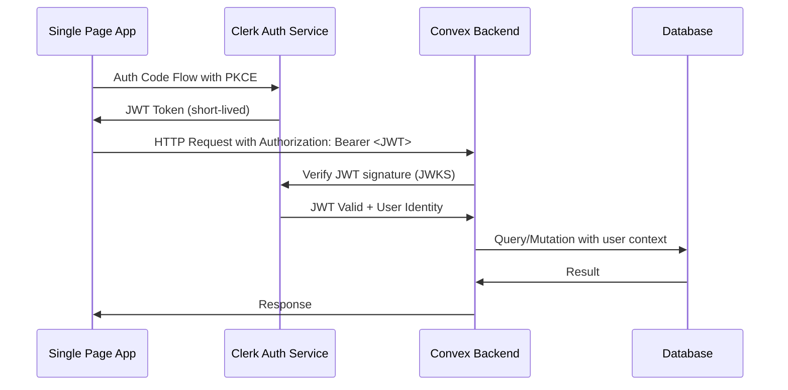
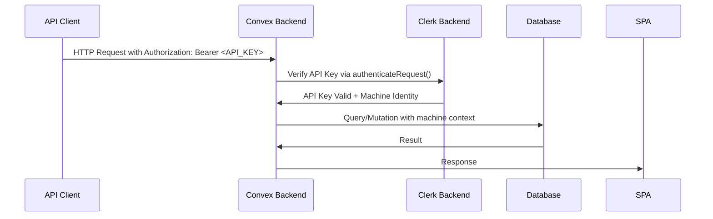
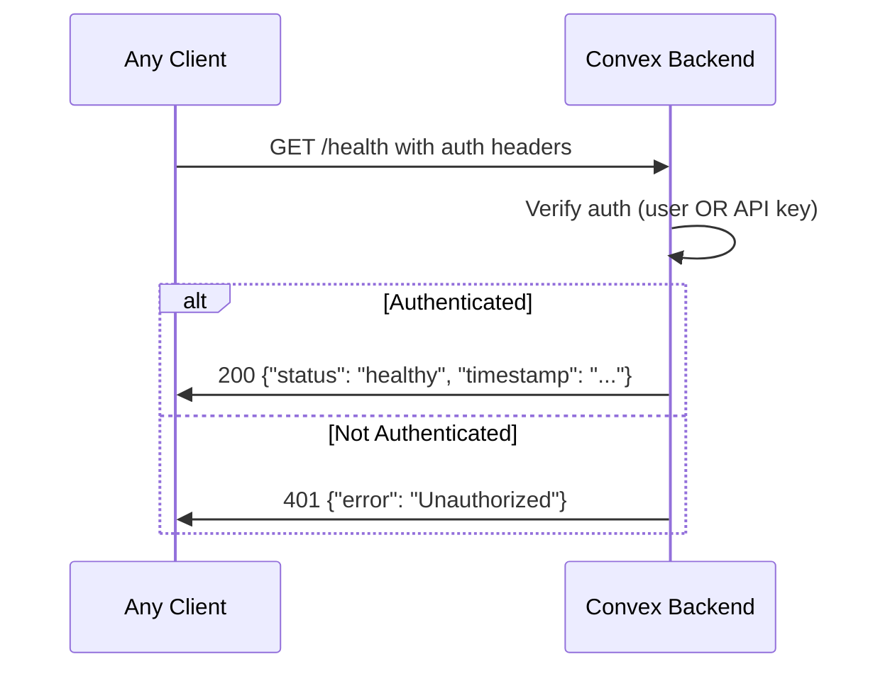

# Liminal Chat Authentication Design & Implementation Plan

## Table of Contents
1. [Architecture Overview](#architecture-overview)
2. [Authentication Flows](#authentication-flows)
3. [Current State Analysis](#current-state-analysis)
4. [Target Architecture](#target-architecture)
5. [Security Considerations](#security-considerations)
6. [Implementation Plan](#implementation-plan)
7. [Code Structure](#code-structure)
8. [Testing Strategy](#testing-strategy)
9. [Migration Strategy](#migration-strategy)

## Architecture Overview

### Vision
Every endpoint in Liminal Chat will support **dual authentication**:
1. **User Authentication**: Auth Code Flow with PKCE from SPAs (via Clerk)
2. **API Key Authentication**: Machine-to-machine authentication (via Clerk API keys)

### Design Principles
- **Security First**: All endpoints require authentication (no public endpoints except health check)
- **Developer Experience**: Simple, consistent auth patterns across all endpoints
- **Flexibility**: Support both interactive users and programmatic access
- **Scalability**: Leverage Clerk's infrastructure for auth management

## Authentication Flows

### 1. User Authentication Flow (SPA → Convex)



**Key Components:**
- **Client**: Uses Clerk's React SDK for PKCE flow
- **Transport**: JWT in `Authorization: Bearer <token>` header
- **Backend**: Convex verifies JWT using Clerk's JWKS endpoint
- **Context**: `ctx.auth.getUserIdentity()` returns user identity

### 2. API Key Authentication Flow (Client → Convex)



**Key Components:**
- **Client**: Uses API key in `Authorization: Bearer <api_key>` header
- **Transport**: API key (starts with `sk_` or custom format)
- **Backend**: Convex verifies API key using Clerk's `authenticateRequest()`
- **Context**: Machine identity with scopes/permissions

### 3. Health Check Flow (Simplified)



## Current State Analysis

### What Works
✅ **Clerk + Convex Integration**: JWT verification with JWKS endpoint  
✅ **User Authentication**: Dev auth bypass for local development  
✅ **Database Schema**: Users, conversations, messages with proper indexes  
✅ **Environment Management**: Type-safe env var access with validation  
✅ **HTTP Actions**: Hono integration for advanced routing  

### What's Broken
❌ **Health Endpoint**: Calls authenticated queries without auth context  
❌ **API Key Support**: No machine authentication implemented  
❌ **Auth Context Propagation**: Actions calling queries with auth issues  
❌ **Test Authentication**: Tests failing due to missing auth tokens  

### What's Complex
⚠️ **Dev Auth Bypass**: Complex dev user simulation system  
⚠️ **Multiple Auth Helpers**: 3 different auth functions (requireAuth, getAuth, getAuthForAction)  
⚠️ **Context Confusion**: Different auth contexts for queries vs actions  

## Target Architecture

### Core Authentication Service

```typescript
// convex/lib/auth.ts - Unified authentication service
export interface AuthContext {
  type: 'user' | 'api_key' | 'dev';
  identity: {
    tokenIdentifier: string;
    email?: string; 
    name?: string;
    scopes?: string[]; // For API keys
  };
  isAuthenticated: boolean;
}

export async function authenticate(ctx: ActionCtx, request: Request): Promise<AuthContext> {
  // 1. Try user JWT authentication first
  // 2. Try API key authentication 
  // 3. Try dev auth bypass (development only)
  // 4. Return unauthenticated context
}
```

### HTTP Action Middleware Pattern

```typescript
// convex/lib/middleware.ts - Auth middleware for HTTP actions
export function withAuth(handler: AuthenticatedHandler) {
  return httpAction(async (ctx, request) => {
    const auth = await authenticate(ctx, request);
    if (!auth.isAuthenticated) {
      return new Response('Unauthorized', { status: 401 });
    }
    return handler(ctx, request, auth);
  });
}
```

### Unified Query/Mutation Auth

```typescript
// convex/lib/auth.ts - Simplified auth for queries/mutations
export async function requireAuth(ctx: QueryCtx | MutationCtx): Promise<AuthContext> {
  // Works with user JWTs from authenticated HTTP actions
  // Dev auth bypass when enabled
}
```

## Security Considerations

### API Key Management
- **Storage**: API keys stored securely in Clerk's system
- **Rotation**: Support for key rotation without service interruption  
- **Scoping**: Granular permissions per API key
- **Monitoring**: Usage tracking and rate limiting per key
- **Revocation**: Immediate key revocation capability

### JWT Security
- **Short-lived Tokens**: JWTs expire quickly (15 minutes default)
- **Signature Verification**: JWKS endpoint validation
- **Issuer Validation**: Strict issuer checking
- **Audience Validation**: Convex-specific audience claims

### Development Security
- **Dev Auth Isolation**: Only works in development environment
- **Production Protection**: Automatic disabling in production
- **Clear Boundaries**: Obvious distinction between dev and production auth

## Implementation Plan

### Phase 1: Fix Health Endpoint

#### Step 1.1: Simple Health Check
**File**: `convex/http.ts`
**Goal**: Health returns 200 with auth, 401 without auth. No database calls.

```typescript
// Replace current health endpoint with:
app.get('/health', async (c) => {
  const ctx = c.env;
  
  // Check if user is authenticated using existing Convex auth
  const identity = await ctx.auth.getUserIdentity();
  
  if (!identity) {
    return c.json({ error: 'Unauthorized' }, 401);
  }
  
  return c.json({
    status: 'healthy',
    authenticated: true,
    timestamp: new Date().toISOString(),
  });
});
```

#### Step 1.2: Update Tests
**File**: `apps/liminal-api/tests/integration.spec.ts`
**Goal**: Test simple health check behavior

```typescript
test('Health check with auth', async ({ request }) => {
  const { response } = await makeChatRequest(request, '/health', {});
  expect(response.status()).toBe(200);
});

test('Health check without auth fails', async ({ request }) => {
  const response = await request.get('/health');
  expect(response.status()).toBe(401);
});
```

### Phase 2: Add API Key Authentication

#### Step 2.1: Research Clerk API Key Setup
**Tasks**:
- Check Clerk dashboard for API key creation
- Understand `authenticateRequest()` with `acceptsToken: 'api_key'`
- Test API key format and verification

#### Step 2.2: Update Authentication Helper
**File**: `convex/lib/auth.ts`
**Goal**: Add API key support to existing auth system

```typescript
import { ActionCtx } from '../_generated/server';
import { createClerkClient } from '@clerk/backend';

export async function authenticateRequest(ctx: ActionCtx, request: Request): Promise<{
  isAuthenticated: boolean;
  identity: any;
  authType: 'user' | 'api_key' | 'dev';
}> {
  // 1. Try existing JWT authentication first
  const userIdentity = await ctx.auth.getUserIdentity();
  if (userIdentity) {
    return {
      isAuthenticated: true,
      identity: userIdentity,
      authType: 'user'
    };
  }
  
  // 2. Try API key authentication
  const authHeader = request.headers.get('authorization');
  if (authHeader?.startsWith('Bearer ')) {
    const token = authHeader.slice(7);
    
    // Check if it looks like an API key (not JWT)
    if (token.startsWith('sk_')) {
      try {
        const clerkClient = createClerkClient({
          secretKey: env.CLERK_SECRET_KEY,
        });
        
        const { isAuthenticated, auth } = await clerkClient.authenticateRequest(request, {
          acceptsToken: 'api_key'
        });
        
        if (isAuthenticated && auth.tokenType === 'api_key') {
          return {
            isAuthenticated: true,
            identity: {
              tokenIdentifier: auth.userId || auth.machineId,
              scopes: auth.scopes || [],
            },
            authType: 'api_key'
          };
        }
      } catch (error) {
        // API key verification failed, continue to dev auth
      }
    }
  }
  
  // 3. Try dev auth bypass (development only)
  if (env.isDevAuthEnabled) {
    return {
      isAuthenticated: true,
      identity: {
        tokenIdentifier: env.DEV_USER_ID,
        email: env.DEV_USER_EMAIL,
        name: env.DEV_USER_NAME,
      },
      authType: 'dev'
    };
  }
  
  return {
    isAuthenticated: false,
    identity: null,
    authType: 'none'
  };
}
```

#### Step 2.3: Update HTTP Endpoints to Use Dual Auth
**File**: `convex/http.ts`
**Goal**: Update endpoints to check both auth methods

```typescript
// Updated health endpoint
app.get('/health', async (c) => {
  const ctx = c.env;
  const auth = await authenticateRequest(ctx, c.req.raw);
  
  if (!auth.isAuthenticated) {
    return c.json({ error: 'Unauthorized' }, 401);
  }
  
  return c.json({
    status: 'healthy',
    authenticated: true,
    authType: auth.authType,
    timestamp: new Date().toISOString(),
  });
});

// Chat endpoints with dual auth
app.post('/api/chat-text', async (c) => {
  const ctx = c.env;
  const auth = await authenticateRequest(ctx, c.req.raw);
  
  if (!auth.isAuthenticated) {
    return c.json({ error: 'Unauthorized' }, 401);
  }
  
  const data = await c.req.json();
  const result = await ctx.runAction(api.chat.simpleChatAction, {
    ...data,
    // Pass user identity to the action
    _userId: auth.identity.tokenIdentifier,
  });
  
  return c.json(result);
});
```

#### Step 2.4: Update Chat Actions to Use Passed User ID
**File**: `convex/chat.ts` 
**Goal**: Remove auth helpers, use passed user ID

```typescript
export const simpleChatAction = action({
  args: {
    prompt: v.string(),
    model: v.optional(v.string()),
    provider: v.optional(v.union(/* providers */)),
    conversationId: v.optional(v.id('conversations')),
    _userId: v.string(), // Passed from authenticated HTTP action
  },
  handler: async (ctx, args) => {
    const { prompt, provider = 'openrouter', model, conversationId, _userId } = args;
    
    let actualConversationId = conversationId;
    
    // Create conversation if needed (using passed user ID)
    if (!actualConversationId) {
      actualConversationId = await ctx.runMutation(api.conversations.create, {
        title: prompt.slice(0, 50) + (prompt.length > 50 ? '...' : ''),
        type: 'standard',
        userId: _userId, // Use passed user ID
        metadata: { provider, model },
      });
    }
    
    // Save user message
    if (actualConversationId) {
      await ctx.runMutation(api.messages.create, {
        conversationId: actualConversationId,
        authorType: 'user',
        authorId: _userId,
        type: 'text',
        content: prompt,
      });
    }
    
    // Generate AI response
    const result = await aiService.generateText({
      provider: provider,
      modelId: model,
      prompt,
    });
    
    // Save AI response
    if (actualConversationId) {
      await ctx.runMutation(api.messages.create, {
        conversationId: actualConversationId,
        authorType: 'agent',
        authorId: provider,
        type: 'text',
        content: result.text,
        metadata: {
          model: result.model,
          provider: result.provider,
          promptTokens: result.usage?.promptTokens,
          completionTokens: result.usage?.completionTokens,
          totalTokens: result.usage?.totalTokens,
          finishReason: result.finishReason,
        },
      });
    }
    
    return {
      ...result,
      conversationId: actualConversationId,
    };
  },
});
```

#### Step 2.5: Update Conversation/Message Queries
**File**: `convex/conversations.ts`, `convex/messages.ts`
**Goal**: Remove auth helpers, accept userId parameter

```typescript
// conversations.ts - simplified create mutation
export const create = mutation({
  args: {
    title: v.string(),
    type: v.union(v.literal('standard'), v.literal('roundtable'), v.literal('pipeline')),
    userId: v.string(), // Passed from authenticated HTTP action
    metadata: v.optional(v.object({
      provider: v.optional(v.string()),
      model: v.optional(v.string()),
    })),
  },
  handler: async (ctx, args) => {
    // No auth checking - userId passed from authenticated HTTP action
    return await ctx.db.insert('conversations', {
      userId: args.userId,
      title: args.title,
      type: args.type,
      metadata: args.metadata,
      lastMessageAt: Date.now(),
      createdAt: Date.now(),
      updatedAt: Date.now(),
    });
  },
});

// messages.ts - simplified create mutation  
export const create = mutation({
  args: {
    conversationId: v.id('conversations'),
    authorType: v.union(v.literal('user'), v.literal('agent'), v.literal('system')),
    authorId: v.string(),
    type: v.union(v.literal('text'), v.literal('tool_call'), v.literal('tool_output')),
    content: v.any(),
    metadata: v.optional(v.object({
      model: v.optional(v.string()),
      provider: v.optional(v.string()),
      promptTokens: v.optional(v.number()),
      completionTokens: v.optional(v.number()),
      totalTokens: v.optional(v.number()),
      finishReason: v.optional(v.string()),
    })),
  },
  handler: async (ctx, args) => {
    // No auth checking - called from authenticated context
    return await ctx.db.insert('messages', {
      ...args,
      createdAt: Date.now(),
      updatedAt: Date.now(),
    });
  },
});
```

### Phase 3: Testing & Integration

#### Step 4.1: Update Integration Tests
**File**: `apps/liminal-api/tests/integration.spec.ts`
**Goal**: Test both authentication methods

```typescript
describe('Authentication Tests', () => {
  test('Health check with JWT token', async ({ request }) => {
    const response = await request.get('/health', {
      headers: { 'Authorization': `Bearer ${process.env.CLERK_TEST_TOKEN}` }
    });
    expect(response.status()).toBe(200);
  });
  
  test('Health check with API key', async ({ request }) => {
    const response = await request.get('/health', {
      headers: { 'Authorization': `Bearer ${process.env.CLERK_API_KEY}` }
    });
    expect(response.status()).toBe(200);
  });
  
  test('Health check without auth fails', async ({ request }) => {
    const response = await request.get('/health');
    expect(response.status()).toBe(401);
  });
});
```

#### Step 4.2: Add API Key Testing
**File**: `apps/liminal-api/test-utils/helpers.ts`
**Goal**: Test helpers for API key authentication

```typescript
export function makeAPIKeyRequest(
  request: APIRequestContext,
  endpoint: string,
  data?: any,
  apiKey?: string
) {
  const headers: Record<string, string> = {
    'Content-Type': 'application/json',
  };
  
  if (apiKey) {
    headers['Authorization'] = `Bearer ${apiKey}`;
  }
  
  return request.post(endpoint, { data, headers });
}
```

#### Step 4.3: Update CI/CD Configuration
**File**: `.github/workflows/backend-ci.yml`
**Goal**: Set environment variables for testing

```yaml
env:
  CLERK_TEST_TOKEN: ${{ secrets.CLERK_TEST_TOKEN }}
  CLERK_API_KEY: ${{ secrets.CLERK_API_KEY }}
```

### Phase 5: Documentation & Cleanup (2-3 hours)

#### Step 5.1: Update Authentication Documentation
**File**: `docs/authentication.md`
**Goal**: Document new dual authentication system

#### Step 5.2: Remove Old Auth System
**Files**: Various
**Goal**: Clean up old auth helpers and dev auth complexity

- Remove `requireAuth`, `getAuth`, `getAuthForAction` from `convex/lib/auth.ts`
- Remove dev auth environment variables (keep only for local dev)
- Simplify user queries/mutations to accept userId parameter
- Update all existing endpoints to use new auth middleware

#### Step 5.3: Add API Documentation
**File**: `docs/api-authentication.md` (new file)
**Goal**: Document API key management and usage

## Code Structure

### New Files
```
convex/
├── lib/
│   ├── auth-service.ts      # Unified authentication service
│   ├── middleware.ts        # HTTP action middleware
│   └── api-keys.ts         # API key management utilities
├── api-keys.ts             # API key CRUD queries/mutations
└── http.ts                 # Updated with auth middleware

docs/
├── api-authentication.md   # API key documentation
└── authentication.md       # Updated auth documentation

tests/
├── auth.spec.ts           # Authentication-specific tests
└── api-keys.spec.ts       # API key management tests
```

### Modified Files
```
convex/
├── lib/
│   ├── auth.ts            # Simplified (remove old helpers)
│   └── env.ts             # Add API key environment variables
├── chat.ts                # Updated to use auth middleware  
├── conversations.ts       # Simplified queries with userId param
├── messages.ts           # Simplified queries with userId param
├── users.ts              # Simplified queries with userId param
└── schema.ts             # Add API key metadata table

apps/liminal-api/
├── tests/
│   ├── integration.spec.ts # Updated with auth tests
│   └── conversation-persistence.spec.ts # Updated with auth
└── test-utils/
    ├── config.ts          # Add API key test config
    └── helpers.ts         # Add API key test helpers
```

## Testing Strategy

### Unit Tests
- Authentication service functions
- Auth middleware behavior
- API key validation logic
- Dev auth bypass functionality

### Integration Tests  
- Health endpoint with both auth methods
- Chat endpoints with JWT tokens
- Chat endpoints with API keys
- API key management CRUD operations
- Unauthorized access scenarios

### Security Tests
- Invalid JWT token handling
- Expired token rejection
- Invalid API key rejection  
- Scope validation for API keys
- Dev auth production protection

## Migration Strategy

### Backward Compatibility
- Maintain existing JWT authentication during transition
- Keep dev auth bypass for local development
- Update endpoints incrementally
- Deprecate old auth helpers gradually

### Rollout Plan
1. **Phase 1**: Deploy foundation cleanup (health endpoint fix)
2. **Phase 2**: Deploy user authentication improvements (no breaking changes)
3. **Phase 3**: Deploy API key authentication (additive feature)
4. **Phase 4**: Deploy complete integration (full dual auth)
5. **Phase 5**: Clean up deprecated code and update documentation

### Risk Mitigation
- Feature flags for new auth methods
- Comprehensive test coverage before deployment
- Gradual migration of endpoints
- Rollback plan for each phase
- Monitoring and alerting for auth failures

## Environment Variables

### Required New Variables
```bash
# Clerk API Key Support (add to Convex environment)
CLERK_SECRET_KEY="sk_live_..."                    # Clerk secret key for API verification

# Test Environment (add to CI/CD)
CLERK_TEST_TOKEN="eyJ0eXAiOiJKV1QiLCJhbGc..."      # Valid JWT for testing
CLERK_API_KEY="sk_test_..."                       # Valid API key for testing
```

### Existing Variables (keep)
```bash
# User Authentication
CLERK_ISSUER_URL="https://deep-shrew-9.clerk.accounts.dev"
CLERK_WEBHOOK_SECRET="whsec_test_secret_for_development_only"

# Development Auth (keep for local dev)
DEV_AUTH_DEFAULT="true"
DEV_USER_ID="user_2zINPyhtT9Wem9OeVW4eZDs21KI"  
DEV_USER_EMAIL="dev@liminal.chat"
DEV_USER_NAME="Dev User"
```

## Success Criteria

### Functional Requirements
✅ All endpoints require authentication (user OR API key)  
✅ Health endpoint returns 200 when authenticated, 401 when not  
✅ Chat endpoints work with both JWT tokens and API keys  
✅ API key management (create, list, revoke) for users  
✅ Integration tests pass with both authentication methods  

### Security Requirements  
✅ JWT signature verification using Clerk's JWKS endpoint  
✅ API key verification using Clerk's backend API  
✅ Proper error handling (don't leak authentication details)  
✅ Dev auth only works in development environment  
✅ Production deployment has all authentication working  

### Performance Requirements
✅ Authentication adds minimal latency (<50ms per request)  
✅ Caching of JWT verification results where appropriate  
✅ Efficient API key lookup and validation  
✅ No impact on database query performance  

---

**Total Estimated Implementation Time: 14-19 hours**

**Recommended Timeline: 2-3 days with testing and validation**